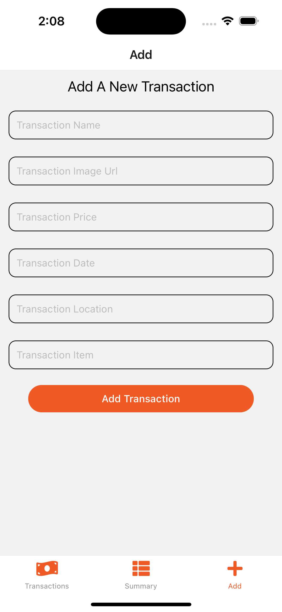

## 💵 Financial App

### This is a financial app that makes use of data from firebase to populate all transactions, added to a list, and can be individually viewed in a detail screen, a summary screen is also provided for insights and you can add to this database on the add screen.

## 📡 Tehnologies

- React Native
- Expo
- React Bottom & Stack Navigation
- JSON Data
- JavaScript (ES6+)

### Screenshots

  
  
  
  

