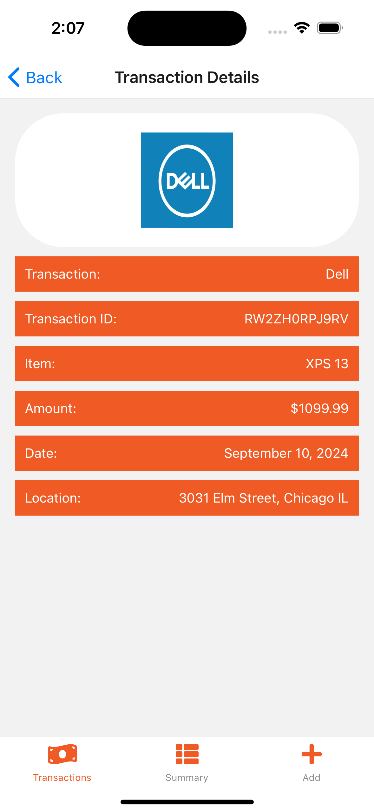

## 💵 Financial App

### This is a financial app that makes use of local .json file to populate all transactions, added to a list, and can be individually viewed in a detail screen,

## 📡 Tehnologies

- React Native
- Expo
- React Navigation
- JSON Data
- JavaScript (ES6+)
- StyleSheet
- FlatList
- TouchableOpacity
- StatusBar
- FontAwesome5
- @react-navigation/native
- @react-navigation/bottom-tabs
- @react-navigation/stack

### Screenshots

  
  
  

